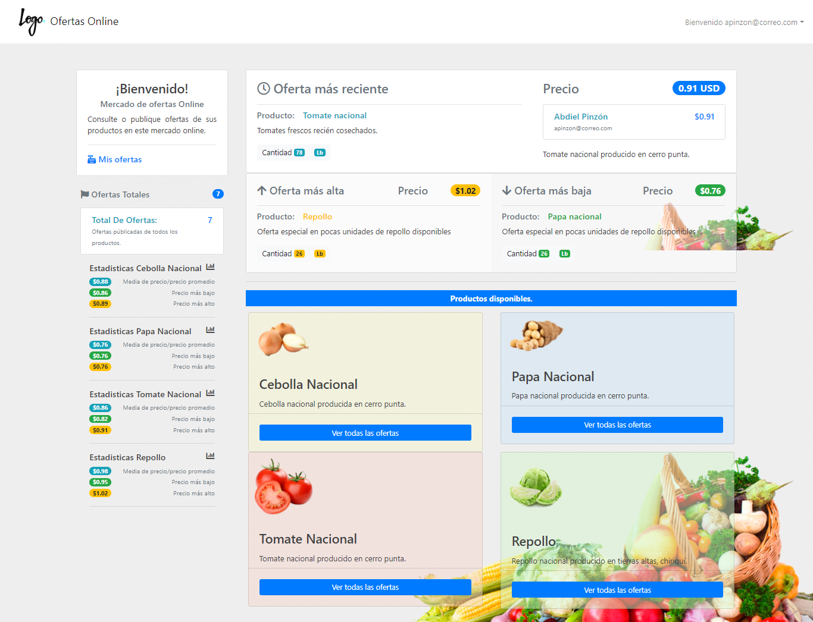

# Mercado-DS7
Mercado de distribución de ofertas online para productos alimenticios. Proyecto final desarrollo de software 7

### Features
- Bootstrap 4.
- Estilos CSS personalizados;
- API REST con Php;
- Modulos:
  - Login.
  - Home (Visualización de ofertas).
  - Creación y edición de ofertas.
- Consultas a base de datos MySQL con rutinas (procedimientos almacenados).

Capturas de pantalla:
-------------
### Login.
         
